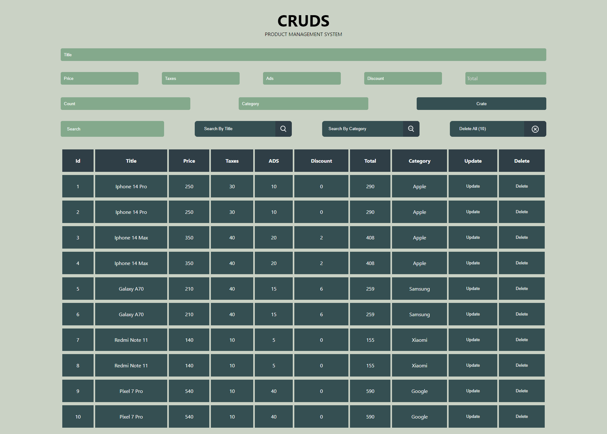

<!-- Please update value in the {}  -->

<h1 align="center">Cruds Product Management System</h1>

  <h3>
    <a href="https://bashar-omar.github.io/Cruds/">
      Demo
    </a>
  </h3>

## Table of Contents

- [Overview](#overview)
  - [Built With](#built-with)
- [Features](#features)
- [How does it work ?](#how-does-it-work)
- [Contact](#contact)

## Overview

CRUDS Stands For (Create, Read, Update, And Delete)
CRUDS is a Simple Project For a Product Management System

- You Can Add a New Product.
- You Can Update The Product Or Delete It.
- You Can Create Any Number Of Products Without Limits
- You Can Search By Title Or Search By Category

### Built With

- <h4>HTML</h4>
- <h4>CSS</h4>
- <h4>Java Script</h4>

## Features

In This Project, You Can Manage Products

You Can Give Him The Price, Taxes, Ads, And Discount, He Will Automatically Collect It.

## How does it work ?

There are some things that are required for the project to work Like :

Title, Price, Category

You Can Cancel It If You Want Or Even Add More.

## Contact

- Website [Incodey](https://incodey.com/)
- GitHub [Bashar-Omar](https://github.com/Bashar-Omar)
- linkedin [bashar-omar](https://www.linkedin.com/in/bashar-omar/)
